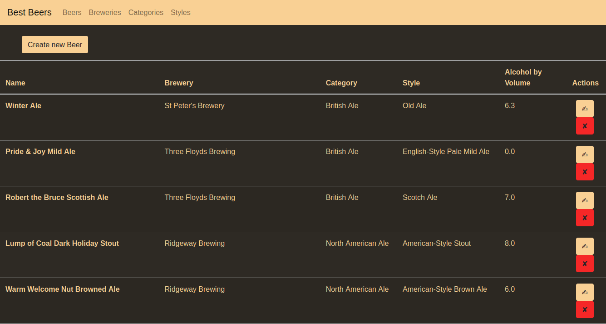
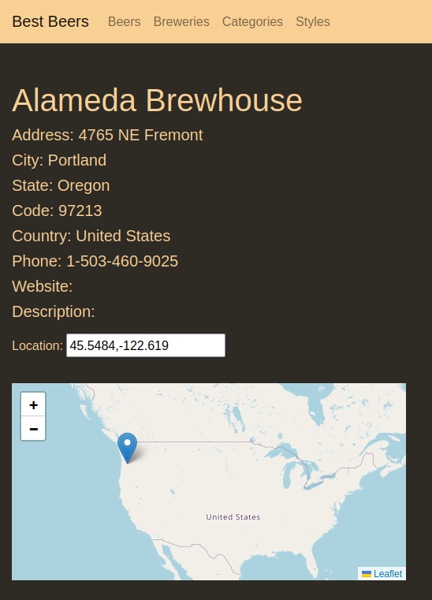
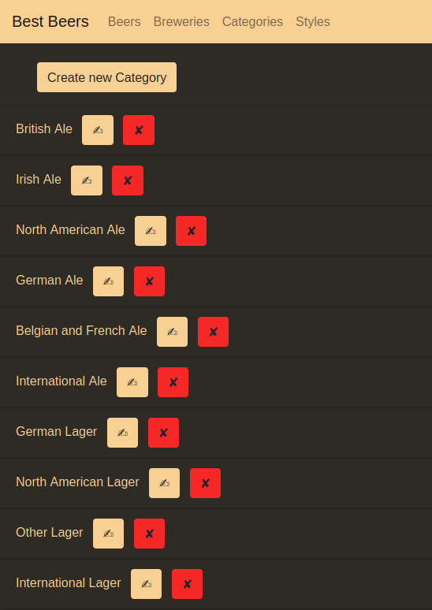

> [!WARNING]
> This project is not intended to promote or encourage the consumption of alcohol. Alcohol is a drug. Regular drinking can make you dependent on it. Alcohol is leading risk factor for death, disease and disability.

# Best Beers [](https://github.com/53845714nF/Best_Beers/actions/workflows/main.yml)

Welcome to Best Beers! This is a web application built using Django framework.
With Best Beers, you can create, update and delete beers, view details about each beer.
You can also view breweries and where they are located in the world.

 <br>



## Installation

```bash
docker run -p 8000:8000 ghcr.io/53845714nf/best_beers/best_beers:latest
```

## Usage

Once you have installed Best_Beers, you can access it by navigating to http://localhost:8000/ in your web browser.
Here are some of the things you can do with Django Beer Manager:

- Create a new beer: Click the "Create new Beer" button and fill out the form with the details of the beer you want to add.
- Update a beer: Click the "✍" button next to the beer you want to update and make changes to the beer's details.
- Delete a beer: Click the "✘" button next to the beer you want to delete.
- View beer details: Click the name of a beer to view its details.

## For Developers 

To install local instance of Best Beers, follow these steps:
1. Clone the repository or download the zip file.
2. Install Python3 and pip3 if they are not already installed.
3. Install the required packages by running the following command in your terminal:
```bash
pip3 install -r requirements.txt
```

4. Run the database migrations by running the following command in your terminal:
```bash
python3 manage.py migrate
```

5. Import Data (Optional if you don't want to use the included sqlite.db.)
```bash
python3 manage.py runscript import_data
```

6. Finally, start the development server by running the following command:
```bash
python3 manage.py runserver
```

## Data sources of the Project

The data for this project comes from the [OpenBeerDB project](https://openbeerdb.com/).

The CSV files were not as good than expected.
